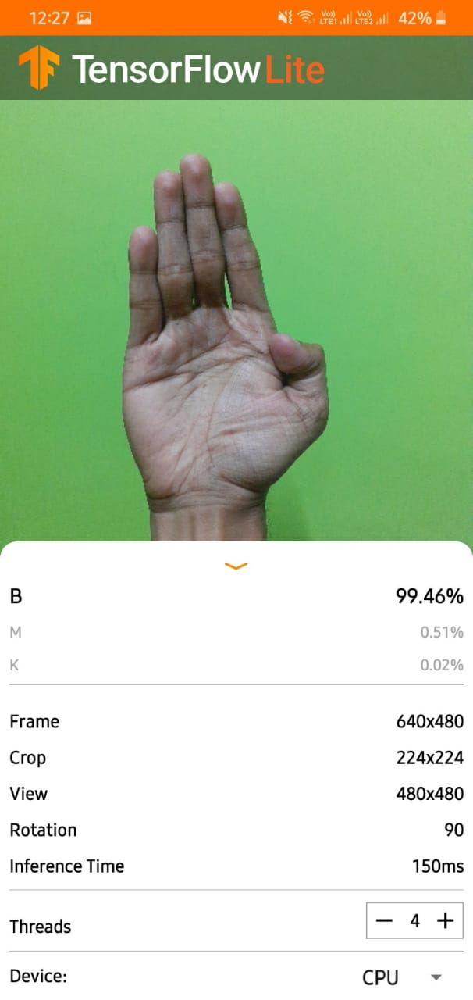

 

## Contributers

# American Sign Language Detection

## Description
American Sign Language Detection is a deep learning end to end project where we can detect American sign Language. It handles upto 29 classes. Used MobileNetv2  to train the images. It is deployed in smartphone using TF-Lite. 

## Future Work
> To convert the predicted text into speech.

## Screenshots

## How to run the App
[Click Here](https://github.com/sayannath/American-Sign-Language-Detection/blob/master/ASL%20App/README.md)

## Pull Request

Pull Requests are welcome. Please follow these rules for the ease of understanding:
* Make sure to check for available issues before raising one
* Give me a maximum of 24-48 hours to respond
* Have proper documentation on the parts you are changing/adding

## Developed & Maintained by

[👨 Sayan Nath](https://sayannath.biz/)

  
#### Show some ❤️ by starring the repository!

