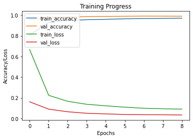
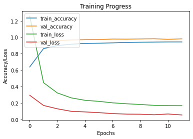

# American Sign Laguage Detection

### Dataset Used 
[Kaggle-Link](https://www.kaggle.com/grassknoted/asl-alphabet)

## Architecture

[MobileNetV2](https://arxiv.org/pdf/1801.04381.pdf) [Used this Architecture to deploy it in Android]

[MobileNetV3Large](https://arxiv.org/pdf/2008.08178.pdf)

## Model Size - [.h5]
> MobileNetV2 - 16MB
> MobileNetV3Large - 24MB

## Result


```
Validation Loss: 0.0368 & Accuracy: 0.9900
```

 

```
Validation Loss: 0.0573 & Accuracy: 0.9825
```
